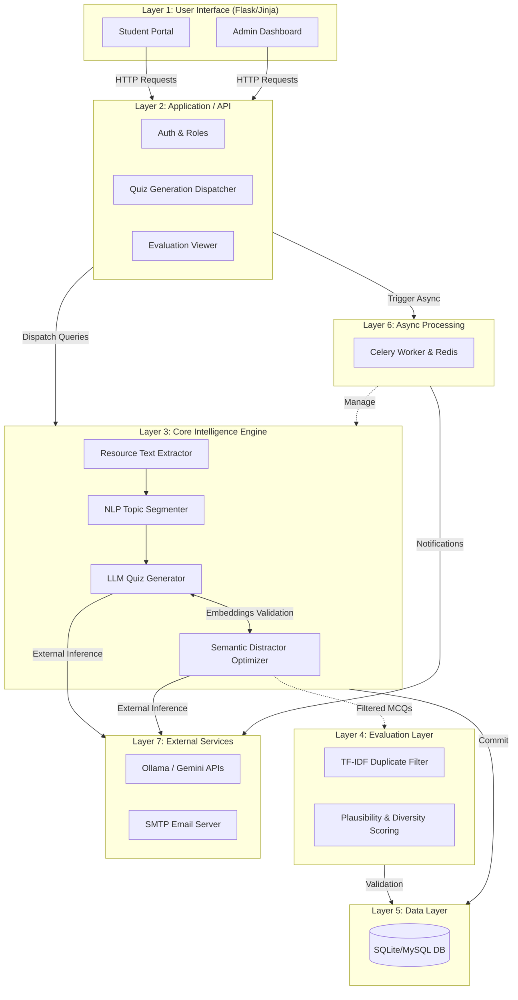

# System Implementation Report
**Automatic Quiz Generation and Evaluation System using LLMs and Distractor Optimization**

This document serves as a comprehensive, professional implementation report detailing the complete architecture and logic deployed within the project. It describes the sequential progression of the system from its foundational setup to the novel research contributions.

---

## 1. Environment & Technical Stack Setup
The foundation of the project relies on a robust open-source stack designed for scalability, AI integration, and asynchronous execution.
*   **Web Framework:** Python Flask 
*   **Database:** SQLite (development) / MySQL (production) managed via SQLAlchemy ORM and Flask-Migrate.
*   **AI Integration:** LangChain / Ollama / Google Gemini APIs configured via a secure `.env` file.
*   **Asynchronous Processing:** Celery worker backed by a Redis message broker.
*   **NLP & Research Tier:** `sentence-transformers` (all-MiniLM-L6-v2) for semantic embeddings, `scikit-learn` for TF-IDF cosine similarity, and `pandas`/`seaborn` for evaluation metrics.

## 2. Database Schema & Architecture Implementation
The relational database is carefully segmented to support multi-tenant classrooms, persistent learning resources, and tracking granular attempts.
*   **User Management (`User`):** Roles include `admin` (teachers/creators) and `user` (students/takers). Password hashes are securely generated via Werkzeug.
*   **Resource & Topics (`Resource`, `ResourceTopic`):** Users upload materials (PDFs, text) that are parsed and saved as `Resource` records. Large contents are segmented into `ResourceTopic` chunks to provide context-aware boundaries for AI generation.
*   **Assessment Entities (`GeneratedQuestion`, `Quiz`):** Questions include metadata like Bloom’s taxonomy level, difficulty, and question type. The JSON-encoded `options` store dynamic MCQ variants.
*   **Classroom & Assignments (`Classroom`, `Assignment`, `AssignmentUser`):** The system allows admins to group users into classrooms, draft assignments from generated quizzes, and dispatch them to targeted cohorts.
*   **Attempt Tracking (`QuizAttempt`, `AttemptAnswer`):** Tracks quiz start time, completion time, score, and granular user answers per generated question to power analytics.

## 3. System Architecture Diagram

The system's full 7-layer architecture is visually documented. You can view the comprehensive styling and flow arrows in the dedicated HTML diagram file:
[View Architecture Diagram (HTML)](./architecture_diagram.html)

Below is a high-level representation of the module interactions and data flow.

## 4. Core Application Routing & Auth (Layer 2)
The Flask backend is modularized using Blueprints for maintainability.
*   **`auth_bp`**: Manages Flask-Login session states.
*   **`admin_bp` / `admin_assignments_bp`**: Dashboard for creating resources, managing classrooms, triggering quiz generations, and evaluating student metrics.
*   **`user_bp`**: Student-facing portal for viewing assigned quizzes and performance histories.
*   **`quiz_bp` / `ai_bp`**: API boundaries where asynchronous generation tasks are requested and parsed.

## 5. Resource Processing & Topic Extraction Pipeline
Before a quiz is generated, raw materials must be contextually structured.
*   **Level 1 (AI Context Extraction):** The system passes the raw document through an LLM prompt to identify sweeping themes and extract nested subtopics.
*   **Level 2 (Text-Based Fallback):** If AI yields insufficient topics (< 5), the pipeline reverts to NLP heuristics (Regex, Title casing, Bullet parsing) to extract structural semantics.
*   **Filtration:** Topic names are stripped of noisy prefixes ("Step 1", "Chapter 2") and short meaningless phrases.
*   **Storage:** Topics are committed to the `ResourceTopic` schema, attaching context windows to database items for localized LLM grounding later.

## 6. AI Quiz Generation & Distractor Optimization (The Novel Contribution)
This represents the primary research layer of the thesis, employing a 4-stage pipeline that guarantees high-quality, non-repetitive quizzes with plausible distractors.

### A. Strict Generation & Normalization
The LLM generates initial batches matching target difficulty, Bloom's level, and question types. Stems are completely normalized (removing grammatical variants of "What is...", "Which of the following") so that structural repetition is mathematically caught early.

### B. Distractor Plausibility & Semantic Validation (Novel Module)
*   **Semantic Plausibility:** Employs `sentence-transformers` to compute vector embeddings. If an incorrect option has >0.92 cosine similarity to the correct answer, it is flagged as *"too similar"*. If it is <0.04, it is flagged as *"irrelevant"*.
*   **AI Distractor Repair:** If options fail the semantic bounds check or fall short of uniqueness, a specialized LLM sub-agent is triggered with a Strict Refinement Prompt to generate 3 new, context-bound, syntactically-balanced distractors.
*   **Length Imbalance Checking:** Calculates the standard deviation of character lengths across options. If it exceeds acceptable bounds, it prompts the AI to rewrite them for psychometric balance (preventing the "longest answer is correct" bias).

### C. Fallback Cascades (Ensuring 100% Fill Rate)
*   **Stage 1:** Strict constraints.
*   **Stage 2:** Relaxes the strict Bloom's Taxonomy filter.
*   **Stage 3:** Relaxes specific sub-topic constraints if the AI exhausts logical question formulations.
*   **Stage 4:** A hard-coded heuristic template injection that acts as the absolute ultimate fallback in case of LLM inference failure, ensuring the quiz is always fully generated for the user without API crashes.

## 7. Evaluation Metrics Engine (Research Component)
A standalone analytical engine (`evaluation_metrics.py`) built to quantitatively prove the superiority of the generated questions versus naive generation.
*   **TF-IDF Duplicate Detection:** Evaluates the cosine similarity matrix of all question stems in the DB. A strict `> 0.85` threshold drops structurally identical but differently phrased questions.
*   **Plausibility & Diversity Scoring:** Vectorizes correct answers against distractors to yield a `plausibility_score`, and distractors against one another for a `diversity_score` (lexical entropy).
*   **Analytics Output:** The engine compiles the runs into CSV reports and dynamically builds correlation heatmaps (`seaborn`) and performance histograms (`matplotlib`), producing literal proof-of-concept visual graphs for the research paper.

## 8. Asynchronous Task execution 
To prevent long-polling API timeouts, heavy compute logic is detached from the UI thread.
*   **Celery Worker Integration:** Initialized in Flask and executed locally over Redis. Configured carefully for Windows environments (`solo` pool) to prevent OS-level threading forks.
*   **Email Engine (`email_tasks.py`):** SMTP credentials dispatch rich HTML email templates to students when admins release assignment results or assign new material.
*   **Async Generation:** The frontend receives a generation dispatch ID and polls the backend while the 4-stage Quiz Optimization logic runs asynchronously.

## 9. Frontend Implementation
The web layer utilizes Jinja2 templating coupled with Bootstrap to create a responsive, modern classroom environment.
*   **Dynamic UI Elements:** AJAX-based loaders, intuitive classroom creation menus, and visual badges for statuses.
*   **Results Visualization:** Utilizes charting libraries to map user historical assignment attempts, giving students and teachers actionable insights into their topic-specific performance.

---
*End of Report.* 
*Generated via System Architect.*
